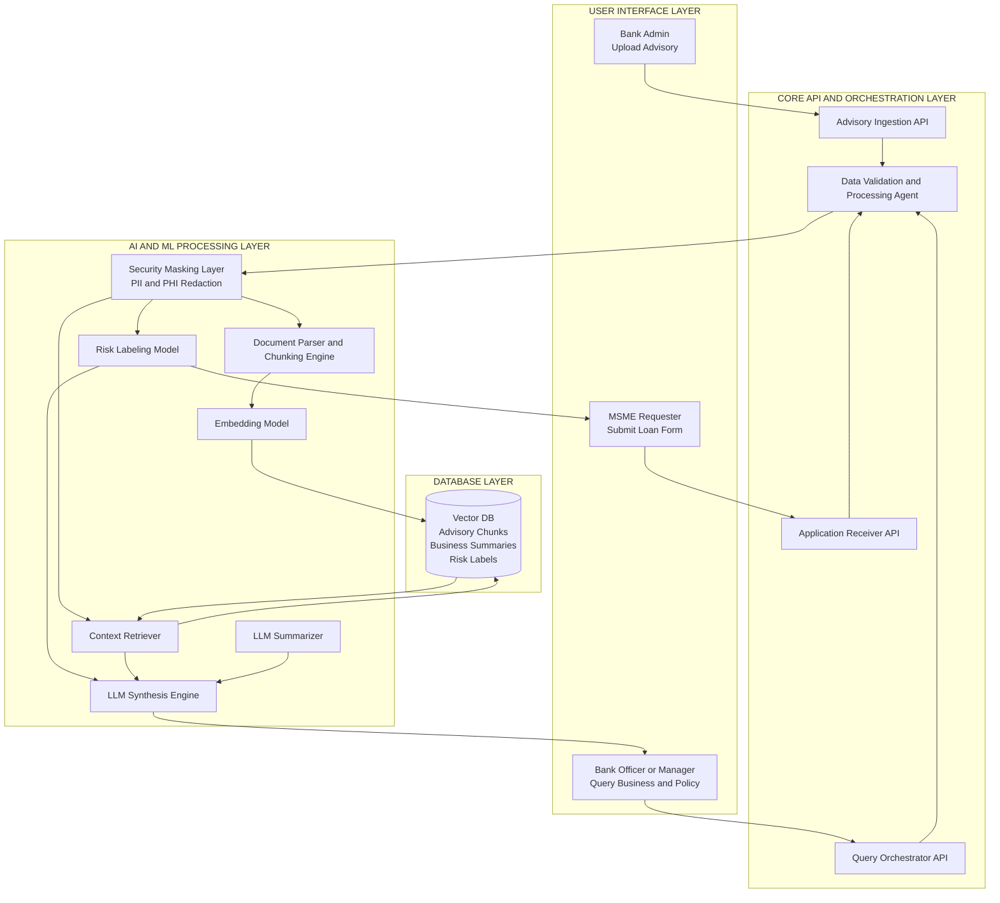
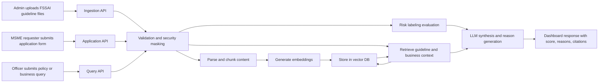
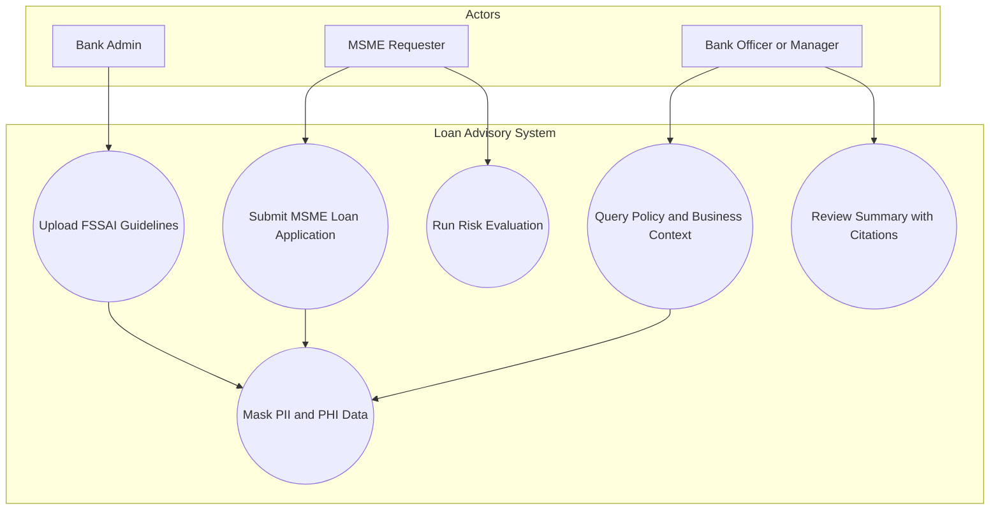

# Architecture and Flow Diagrams

This file includes the requested architecture, process flow, and use case diagrams for the FSSAI-focused loan advisory prototype.

## 1) Architecture Diagram

## 2) Process Flow Diagram

## 3) Use Case Diagram

## Notes

- Scope is fixed to food processing and FSSAI guideline context.
- Security masking runs before indexing and before model evaluation.
- UI layer now directly supports all three personas.
