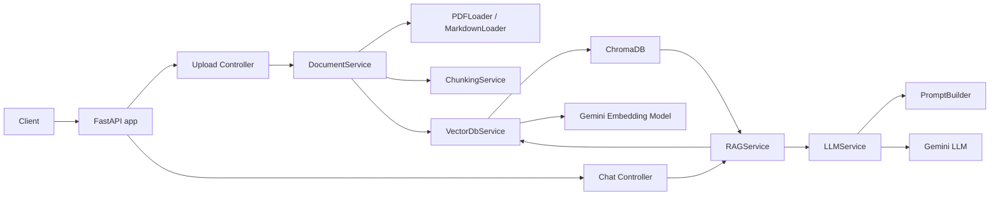
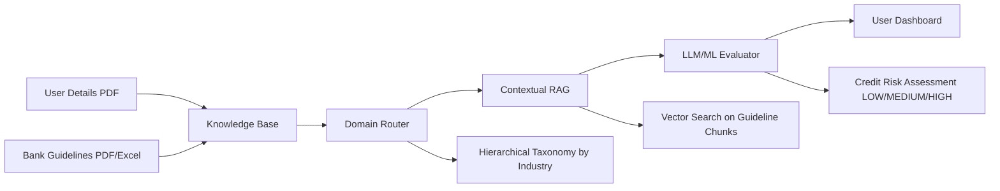
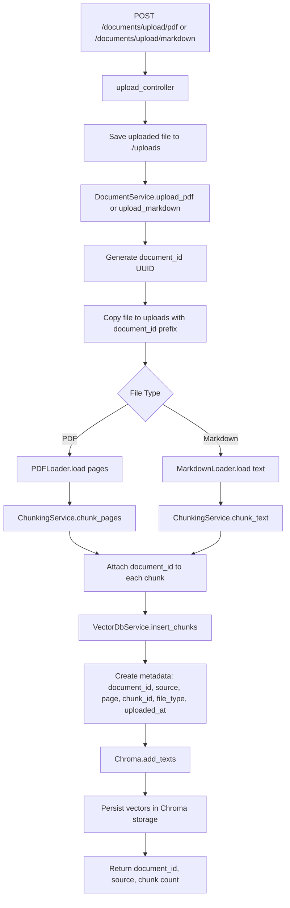
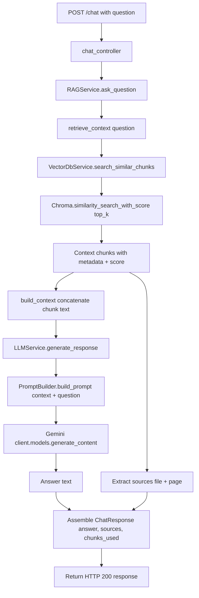
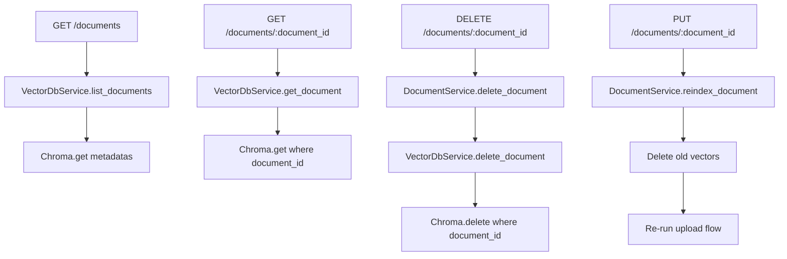

# RAG Pipeline Flow Diagram

This document explains what the current solution does and how requests move through the system.

## What The Solution Does

- Exposes a FastAPI backend for uploading documents and asking questions.
- Supports PDF and Markdown ingestion.
- Splits documents into chunks.
- Generates embeddings using Google Gemini embeddings.
- Stores vectors and metadata in ChromaDB.
- On chat queries, retrieves top-k similar chunks and sends context + question to Gemini LLM.
- Returns the generated answer with source file/page references.

## High-Level Architecture

## Industry-Guideline Advisory Flow (Requested)

This is implemented through:

- `Document role` metadata (`guideline` vs `applicant`) on upload.
- `Industry` metadata tagging for guideline uploads.
- `DomainRouterService` industry extraction from applicant PDF text.
- `RiskAssessmentService` retrieval of matching guideline chunks.
- `LLMService.generate_risk_assessment` for structured scoring.

## Document Upload / Indexing Flow

## Chat / Retrieval-Augmented Generation Flow

## Other Endpoints

## Notes About Current Behavior

- `reindex_document` currently creates a new UUID through upload methods instead of preserving the requested `document_id`.
- `RAGService.ask_question` prints context and chunks to stdout for every query.
- `README.md` model names differ from `config/settings.py` defaults.
- `pyproject.toml` has no declared dependencies; runtime dependencies are in `requirements.txt`.
